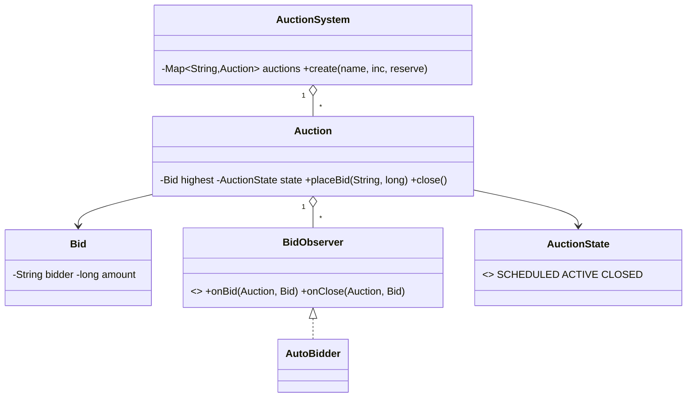

# Design an Online Auction System — Concept

## What Is It?

An **online auction** where bidders compete on an item until a close time and the highest valid bid wins. The canonical Medium money-events problem — bids must only ratchet upward by a minimum increment, watchers react to every bid (Observer), and the auction itself moves `SCHEDULED → ACTIVE → CLOSED`.

| | |
|---|---|
| **Difficulty** | Medium |
| **Patterns** | Observer, State, Strategy |
| **Core** | ascending bid ladder (current + min increment + reserve) + close decides the winner |

---

## Requirements

**Functional**
- **Create auctions** for an item with start/end time and an optional **reserve price**.
- **Place bids** that exceed the current highest bid by at least the **minimum increment** (and meet the reserve).
- **Close** the auction: the highest bidder wins if the reserve is met; otherwise no sale.
- **Watch** an auction — on every bid and on close, watchers are notified.

**Non-functional**
- Concurrent bids must not lose updates — the bid ladder updates atomically.
- Auto-bidding (bid on someone's behalf up to a max) layers on via Observer without changing `Auction`.

---

## Core Entities

| Entity | Responsibility |
|--------|----------------|
| `AuctionSystem` | Creates and tracks auctions |
| `Auction` | Item, increment, reserve, current highest bid, state, observers |
| `Bid` | Bidder id, amount, timestamp — immutable |
| `AuctionState` | `SCHEDULED → ACTIVE → CLOSED` |
| `BidObserver` | `onBid` / `onClose` notifications |
| `AutoBidder` (proxy) | Watches and raises on your behalf up to a max |

---

## Class Diagram

---

## Related

- [[../00 - Index|Medium Problems Index]]
- [[../../00 - Index|LLD Problems Index]]
- [[../../../00 - Index|LLD Main Index]]
- [[../../../Patterns/Behavioural/14 - Observer/Concept|Observer]] · [[../../../Patterns/Behavioural/17 - State/Concept|State]] · [[../../../Patterns/Behavioural/15 - Strategy/Concept|Strategy]]

---

#lld #machine-coding #auction #medium #concept