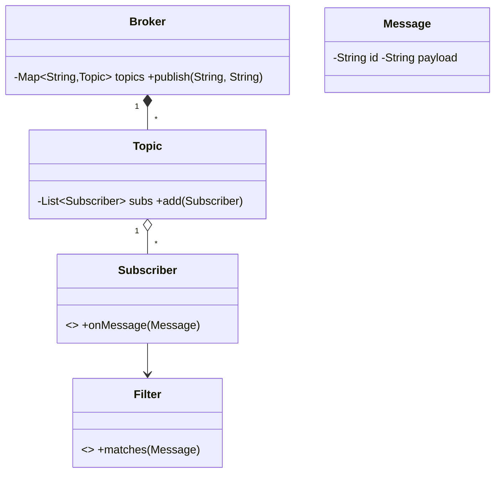

# Design Pub Sub System — Concept

## What Is It?

An in-process **publish-subscribe** broker where **publishers** emit messages to **topics** and the broker fans out to **subscribers** with at-least-once delivery. The canonical Medium Observer problem — subscribe once, receive forever, unsubscribe cleanly.

| | |
|---|---|
| **Difficulty** | Medium |
| **Patterns** | Observer, Singleton |
| **Core** | topics → subscriber lists → queued fan-out → ack/retry |

---

## Requirements

**Functional**
- Create **topics**; **subscribe / unsubscribe** with optional message **filters**.
- **Publish** a message → all current subscribers receive it, in publish order per topic.
- **Durable** subscribers get missed messages on resubscribe (retention window); slow subscribers never block publishers.

**Non-functional**
- Publish returns fast — fan-out through a queue, not inline loops.
- Ordering per topic + subscriber; no cross-topic ordering promise.

---

## Core Entities

| Entity | Responsibility |
|--------|----------------|
| `Broker` (Singleton) | Topic registry; `publish` enqueues, workers drain |
| `Topic` | Subscriber list + retained message buffer |
| `Subscriber` | Callback + filter + durable offset |
| `Message` | Id, topic, payload, timestamp |
| `DeliveryWorker` | Dequeues and invokes callbacks with retry |

---

## Class Diagram

---

## Related

- [[../00 - Index|Medium Problems Index]]
- [[../../00 - Index|LLD Problems Index]]
- [[../../../00 - Index|LLD Main Index]]
- [[../../../Patterns/Behavioural/14 - Observer/Concept|Observer]] · [[../Design-LinkedIn/Concept|LinkedIn]]

---

#lld #machine-coding #pubsub #medium #concept
