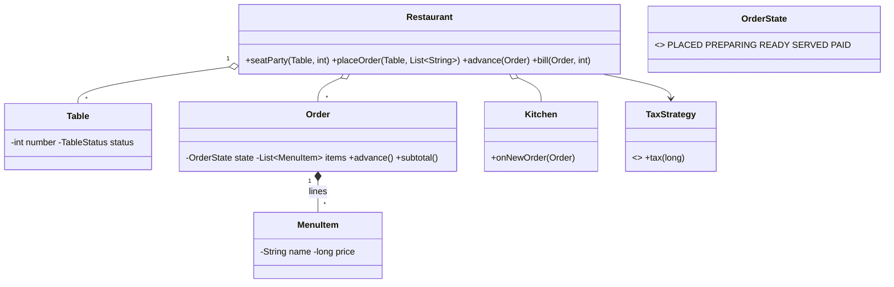

# Design Restaurant Management System — Concept

## What Is It?

A **restaurant**: tables get seated, orders flow from the floor to the kitchen and back (`PLACED → PREPARING → READY → SERVED → PAID`), and the bill adds tax and tip. The canonical Medium workflow problem — two state machines (table, order) and one observer (the kitchen).

| | |
|---|---|
| **Difficulty** | Medium |
| **Patterns** | State, Observer, Strategy |
| **Core** | order state machine + kitchen observer + bill with tax/tip strategies |

---

## Requirements

**Functional**
- **Tables** with capacity; seat a party (`FREE → OCCUPIED`), close after payment.
- **Menu** items with prices; place an order for a table (prices snapshotted at order time).
- Order states: `PLACED → PREPARING → READY → SERVED → PAID` — advance in order, never skip.
- **Kitchen** sees new orders immediately (Observer); **bill** = subtotal + tax (+ tip).

**Non-functional**
- A table never holds two open orders; order transitions are guarded; tax/tip rules plug in.

---

## Core Entities

| Entity | Responsibility |
|--------|----------------|
| `Restaurant` (facade) | Tables, menu, orders, billing |
| `Table` | Number, seats, live `TableStatus` |
| `MenuItem` | Name + price |
| `Order` | Table, item lines, `OrderState`, guarded `advance()` |
| `Kitchen` (Observer) | Reacts to `PLACED` orders |
| `TaxStrategy` | Tax for a subtotal |

---

## Class Diagram

---

## Related

- [[../00 - Index|Medium Problems Index]]
- [[../../00 - Index|LLD Problems Index]]
- [[../../../00 - Index|LLD Main Index]]
- [[../../../Patterns/Behavioural/17 - State/Concept|State]] · [[../../../Patterns/Behavioural/14 - Observer/Concept|Observer]] · [[../../../Patterns/Behavioural/15 - Strategy/Concept|Strategy]]

---

#lld #machine-coding #restaurant #medium #concept