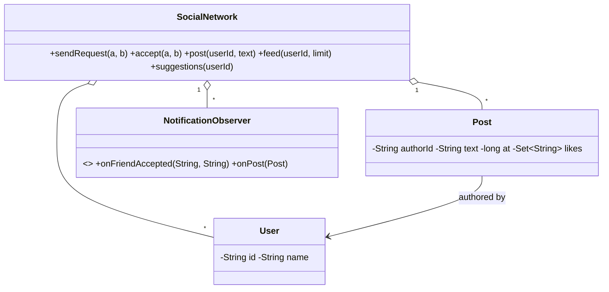

# Design a Social Network like Facebook — Concept

## What Is It?

A **social network**: users befriend each other (mutual edges), post updates, and read a feed of friends' posts — plus **friend suggestions** from friends-of-friends. The canonical Medium graph problem — adjacency maps, BFS, and feed fan-out.

| | |
|---|---|
| **Difficulty** | Medium |
| **Patterns** | Observer, Strategy, Graph (BFS) |
| **Core** | mutual adjacency map + friends-of-friends BFS + time-ordered feed merge |

---

## Requirements

**Functional**
- **Users** join; **friend requests** sent/accepted/removed — friendship is mutual once accepted.
- **Post** updates; friends can **like** and **comment**.
- **Feed** — a user's own + friends' posts, newest first, limited.
- **Friend suggestions** — friends-of-friends ranked by mutual-friend count.

**Non-functional**
- Suggestions must not scan all user pairs — BFS over the graph, depth 2 only.
- Feed reads must not block posts; rankings plug in as a strategy.

---

## Core Entities

| Entity | Responsibility |
|--------|----------------|
| `SocialNetwork` (facade) | Users, graph, posts, feed, suggestions |
| `User` | Id + name |
| `friends` graph | `Map<userId, Set<userId>>` — mutual edges |
| `Post` | Author, text, timestamp, likes, comments |
| `FeedRanking` (extension) | Recency now; affinity/engagement later |
| `NotificationObserver` | Told on friend accept and on new posts |

---

## Class Diagram

---

## Related

- [[../00 - Index|Medium Problems Index]]
- [[../../00 - Index|LLD Problems Index]]
- [[../../../00 - Index|LLD Main Index]]
- [[../../../Patterns/Behavioural/14 - Observer/Concept|Observer]] · [[../../../Patterns/Behavioural/15 - Strategy/Concept|Strategy]] · [[../Design-LinkedIn/Concept|LinkedIn]]

---

#lld #machine-coding #social-network #medium #concept