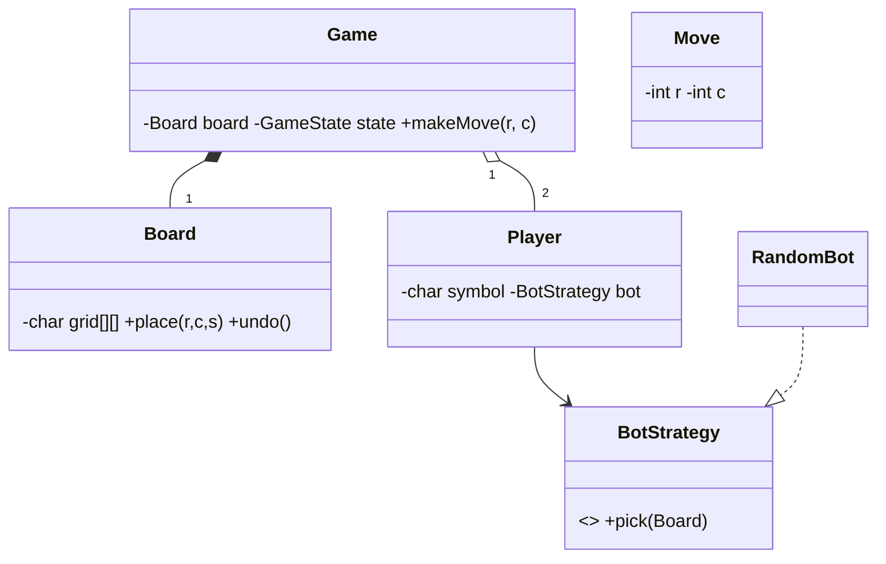

# Design Tic Tac Toe Game — Concept

## What Is It?

A two-player **Tic Tac Toe** engine on an N×N board where players place marks alternately and the first full row / column / diagonal wins. The canonical Medium game-state problem — O(1) win detection via counters, State for game lifecycle, Strategy for bots.

| | |
|---|---|
| **Difficulty** | Medium |
| **Patterns** | State, Strategy, Command |
| **Core** | board + row/col/diag counters; move → validate → place → detect → next turn |

---

## Requirements

**Functional**
- N×N **board** (default 3×3); two **players** (X / O, human or bot) alternate moves.
- **Validate** moves (in bounds, cell empty, game live); **detect** win or draw immediately after each move.
- Support **undo** of the last move and **replay** from move history.

**Non-functional**
- Win detection must be O(1) per move — no full-board scan.
- Bot levels plug in as strategies — no engine changes.

---

## Core Entities

| Entity | Responsibility |
|--------|----------------|
| `Game` (context) | Board, players, counters, state; `makeMove` is the single entry |
| `GameState` | `IN_PROGRESS / WON / DRAWN`; transitions only in `Game` |
| `Board` | Cell grid + placement + undo stack |
| `Player` | Symbol + `BotStrategy` (human = console input) |
| `BotStrategy` | Picks a cell: random / blocking / minimax |
| `Move` (Command) | Row + col + player; `execute / undo` |

---

## Class Diagram

---

## Related

- [[../00 - Index|Medium Problems Index]]
- [[../../00 - Index|LLD Problems Index]]
- [[../../../00 - Index|LLD Main Index]]
- [[../../../Patterns/Behavioural/17 - State/Concept|State]] · [[../../../Patterns/Behavioural/15 - Strategy/Concept|Strategy]]

---

#lld #machine-coding #tic-tac-toe #medium #concept
