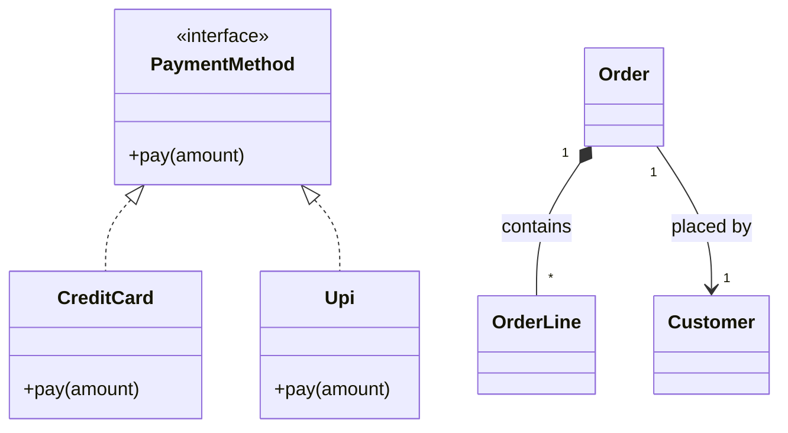

# Class Diagram — Concept

## What Is It?

A **UML class diagram** is the primary artefact of an LLD interview. It shows **classes** (boxes with name + attributes + methods), their **relationships**, and their **multiplicities**. If you can draw a clean class diagram, you can defend your design — code is just the translation step.

---

## When to Use

> **Trigger keywords:** "design the classes", "show relationships", "who owns what", "extend", "use", "contain"

Draw a class diagram **first**, always. It forces you to answer three questions before writing code:

1. **What are the entities?** (classes / enums / interfaces)
2. **How are they related?** (association / aggregation / composition / inheritance)
3. **What are the public operations?** (methods that satisfy the use cases)

---

## The Box Format

```
+----------------------------------+
|           ClassName              |   ← class name
+----------------------------------+
| - field: Type                    |   ← attributes  (- private, + public, # protected)
+----------------------------------+
| + method(args): ReturnType       |   ← operations
+----------------------------------+
```

---

## Relationships & Notation

| Relationship | Notation | Meaning | Example |
|--------------|----------|---------|---------|
| **Inheritance (is-a)** | solid line + hollow triangle `──▷` | subclass extends superclass | `Car ──▷ Vehicle` |
| **Realisation** | dashed line + hollow triangle `╌╌▷` | class implements interface | `CreditCard ╌╌▷ PaymentMethod` |
| **Association** | solid line | class knows/uses another | `Driver ── Ride` |
| **Aggregation (has-a)** | line + hollow diamond `◇──` | weak ownership, shared, outlives part | `Department ◇── Professor` |
| **Composition (owns-a)** | line + filled diamond `◆──` | strong ownership, part dies with whole | `Order ◆── OrderLine` |
| **Dependency** | dashed line + arrow `╌╌▶` | temporary use (param/local) | `Order ╌╌▶ InvoiceService` |

**Multiplicity** is written at the ends: `1`, `0..1`, `*`, `1..*`.

---

## Visual Walkthrough

```
        ┌─────────────────┐
        │   <<interface>> │
        │  PaymentMethod  │
        └────────┬────────┘
                 ╌╌▷ (realise)
        ┌────────┴────────┐
        ▼                 ▼
 ┌────────────┐    ┌────────────┐
 │ CreditCard │    │    Upi     │
 └────────────┘    └────────────┘

 ┌────────────┐  ◆──*  ┌────────────┐
 │   Order    │ ◆──────│  OrderLine │    (composition: lines die with the order)
 └─────┬──────┘ 1      └────────────┘
       │ 1
       │ (association)
       │ *
 ┌─────▼──────┐
 │  Customer  │
 └────────────┘
```

---

## Mermaid (renders in Obsidian)



---

## Common Mistakes

1. **Drawing only classes, no relationships** — the relationships *are* the design.
2. **Confusing aggregation and composition** — ask "does the part die with the whole?" → composition.
3. **Forgetting multiplicity** — `Order` has `1..*` lines, not an unbounded list.
4. **Naming relationships as methods** — relationships are structural, not behavioural.
5. **Over-modelling** — don't add classes not referenced by any use case.

---

## Related Patterns

- [[../02 - Sequence Diagram/Concept|Sequence Diagram]] — the dynamic counterpart
- [[../../Concepts/02 - Class Relationships/00 - Index|Class Relationships]] — has-a vs is-a in depth

---

#uml #class-diagram #lld #concept