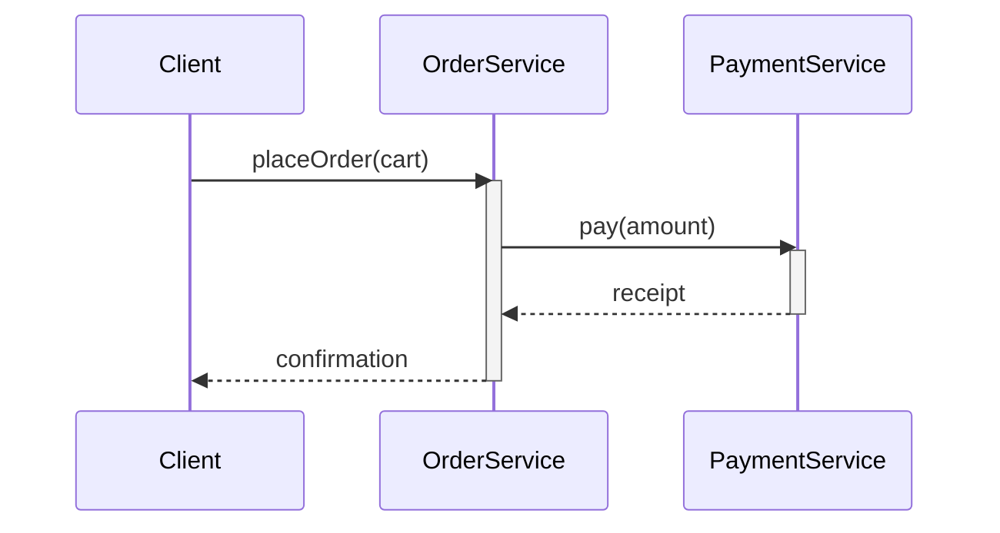
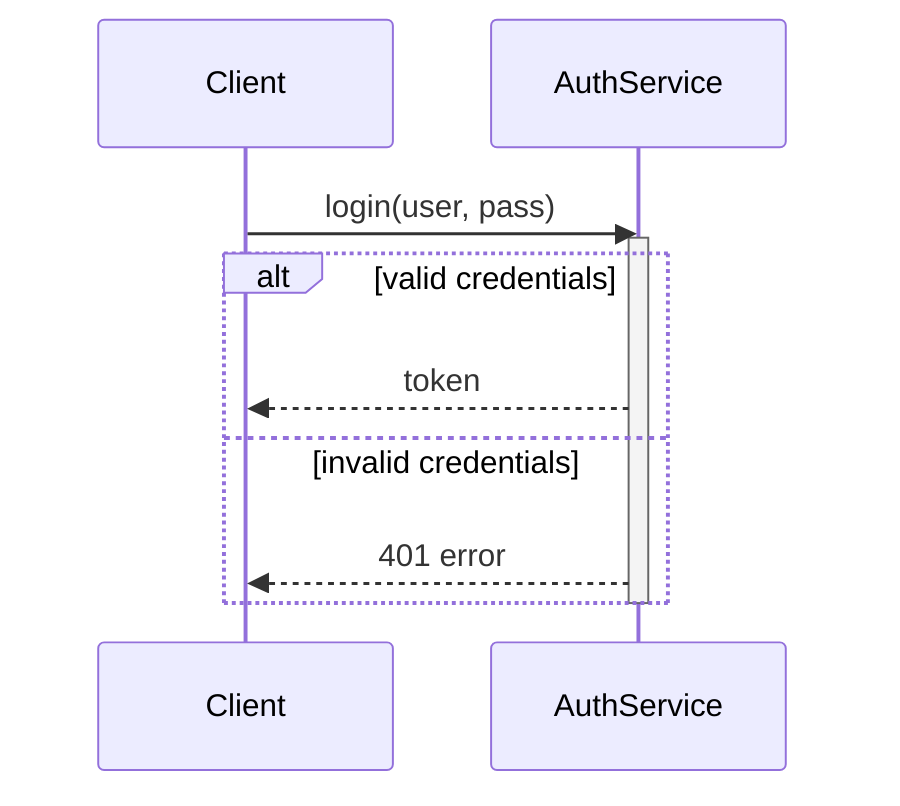

# Sequence Diagram — Concept

## What Is It?

A **UML sequence diagram** shows **message flow between objects over time** — who calls whom, in what order, and what comes back. It is the *dynamic* counterpart of the class diagram (which shows *structure*). In an LLD interview, the sequence diagram proves your workflow actually works end-to-end.

---

## When to Use

> **Trigger keywords:** "show the flow", "walk through", "what happens when", "order of calls", "who calls whom"

Draw a sequence diagram for **one key workflow** (e.g. book → pay, login → fetch profile). It answers:

1. **Which objects participate?** (lifelines across the top)
2. **In what order do messages flow?** (top → bottom = time)
3. **Where are the branches and loops?** (alt / loop fragments)

---

## The Building Blocks

```
         ┌──────┐   ┌────────┐   ┌─────────┐
         │Client│   │ Order  │   │Payment  │
         └──┬───┘   └───┬────┘   └────┬────┘
            │           │             │        ← lifeline (time runs down)
            │ placeOrder()           │
            │──────────▶│             │
            │           │ pay()       │
            │           │────────────▶│
            │           │◀ ─ ─ ─ ─ ─ ─│  return (dashed)
            │◀ ─ ─ ─ ─ ─│             │  return
         activation ─┤ ▓▓▓ ├─  (thin box = method executing)
```

| Element | Meaning |
|---------|---------|
| **Lifeline** | a participating object (dashed vertical line) |
| **Synchronous message** `──▶` | call that waits for a reply (solid arrow) |
| **Return** `╌╌▶` | reply (dashed arrow) |
| **Activation bar** | thin box showing a method is executing |
| **`alt` fragment** | if/else branch |
| **`loop` fragment** | repeated messages |
| **`opt` fragment** | optional messages |

---

## Mermaid (renders in Obsidian)



---

## alt / loop in Practice



---

## Common Mistakes

1. **Modelling every method** — one diagram per workflow, not per class.
2. **No returns** — every synchronous call needs its dashed reply; otherwise the flow looks one-way.
3. **Mixing levels** — don't put DB schema details in a service-level flow.
4. **Forgetting alt/loop labels** — an unlabelled box hides the branching logic.
5. **Wrong lifeline order** — put the initiator left, dependencies to the right.

---

## Related

- [[../01 - Class Diagram/Concept|Class Diagram]] — the structural counterpart
- [[../04 - Activity Diagram/Concept|Activity Diagram]] — for branching-heavy logic
- [[../../Concurrency/Patterns/00 - Index|Concurrency Patterns]] — when the flow spans threads

---

#uml #sequence-diagram #lld #concept
