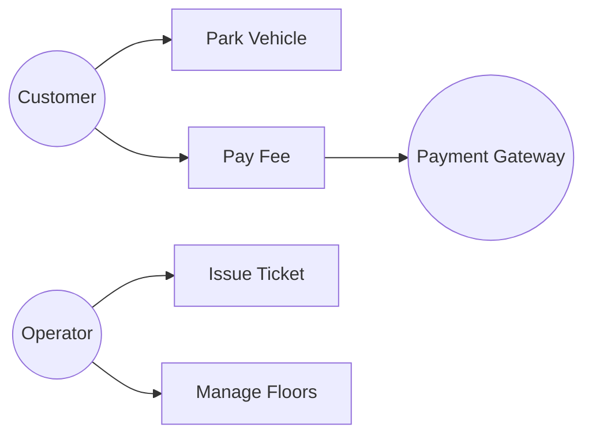

# Use Case Diagram — Concept

## What Is It?

A **UML use case diagram** scopes **who wants what from the system** — actors (stick figures) on the sides, goals (ovals) in the middle, lines connecting them. In an LLD interview, it is the 2-minute scoping tool you draw *before* the class diagram: it turns a vague prompt into an agreed feature list.

---

## When to Use

> **Trigger keywords:** "what should the system do", "who uses it", "scope", "requirements", "actors"

Draw it **first**, while clarifying requirements. It answers:

1. **Who are the actors?** (humans + external systems)
2. **What is each actor's goal?** (one oval per goal)
3. **What is out of scope?** (no oval → not building it)

---

## The Building Blocks

```
        ┌─────────────────────────────────┐
  (actor)│        Parking Lot System       │
 Customer │                                 │
    ○────┼──○ Park Vehicle                  │
         │  ○ Pay Fee                       │
  Operator│  ○ Issue Ticket                 │
    ○────┼──○ Manage Floors                 │
         │         ○ Collect Payment ○──────┼────○ Payment Gateway
         │                                  │      (external actor)
         └─────────────────────────────────┘
              ▭ = system boundary
```

| Element | Meaning |
|---------|---------|
| **Actor** (stick figure / `○` label) | a role outside the system — human *or* external system |
| **Use case** (oval) | one goal the actor achieves with the system |
| **Association** (line) | actor participates in that goal |
| **`<<include>>`** (dashed) | one goal always needs another (Pay Fee includes Calculate Fare) |
| **`<<extend>>`** (dashed) | optional add-on (Apply Coupon extends Pay Fee) |
| **System boundary** (box) | everything inside is yours to build; actors stay outside |

---

## Mermaid (renders in Obsidian)

> Mermaid has no use-case diagram type — model it as a flowchart with actors as nodes:



---

## Scoping Example: Parking Lot (60 seconds)

| Actor | Goals |
|-------|-------|
| Driver | Park Vehicle, Pay Fee, Extend Booking |
| Attendant | Issue Ticket, Override Barrier |
| Payment Gateway | (external) Collect Payment |

Anything without an oval — valet assignment, surge pricing — is **explicitly out of scope** unless the interviewer adds it.

---

## Common Mistakes

1. **Modelling steps, not goals** — "Enter Card Number" is a step; "Pay Fee" is the goal.
2. **Forgetting external systems** — payment gateway, notification service are actors too.
3. **No system boundary** — without the box, nobody knows what you're actually building.
4. **Too many ovals** — 3–6 goals; more means you haven't scoped.
5. **Skipping it entirely** — jumping to classes before agreeing scope is the #1 LLD failure.

---

## Related

- [[../01 - Class Diagram/Concept|Class Diagram]] — every oval becomes candidate classes + operations
- [[../04 - Activity Diagram/Concept|Activity Diagram]] — expand one oval into its step-by-step flow
- [[../../Problems/00 - Index|LLD Problems Index]] — scope each problem with this first

---

#uml #use-case-diagram #lld #concept
