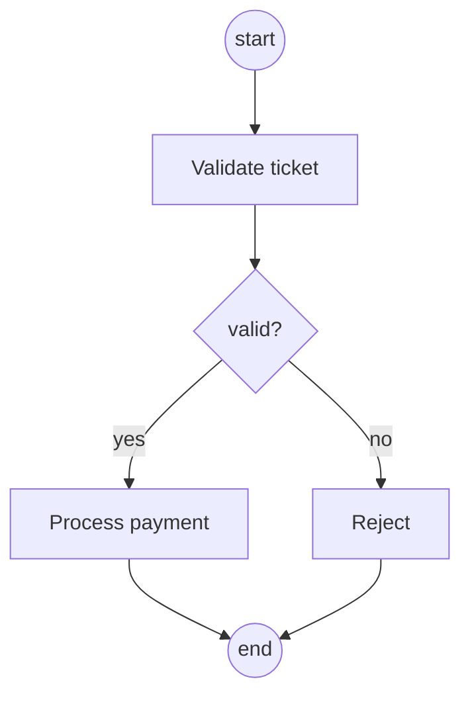
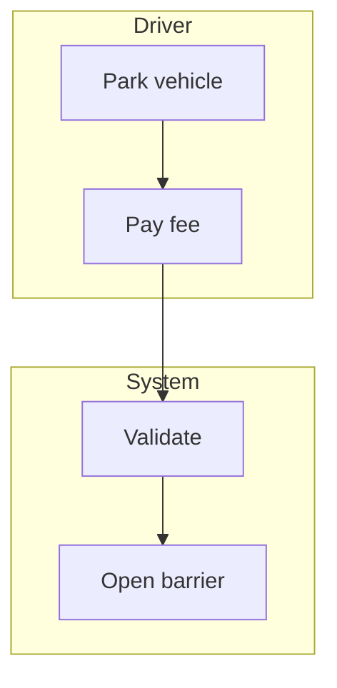

# Activity Diagram — Concept

## What Is It?

A **UML activity diagram** models **control flow** — the step-by-step path through a business process, with branches, parallelism, and decision points. Think flowchart with swimlanes. In an LLD interview, reach for it when a workflow has enough branching that a sequence diagram gets tangled.

---

## When to Use

> **Trigger keywords:** "workflow", "steps", "if/else", "in parallel", "approval process", "algorithm flow"

| Situation | Diagram |
|-----------|---------|
| Object-to-object call order | **Sequence** diagram |
| **Branching-heavy business process** | **Activity** diagram — this package |
| Object changing state over time | **State Machine** diagram |

---

## The Building Blocks

```
        ●                  ← start (filled circle)
        │
   ┌────▼────┐
   │ Validate │             ← activity (rounded box)
   └────┬────┘
        │◆               ← decision (diamond)
   ┌────┴─────┐
   │ valid?   │
   └──┬───┬───┘
   yes│   │no
   ┌──▼─┐ ┌▼──────┐
   │Pay │ │ Reject │
   └──┬─┘ └┬──────┘
      │ ━━━ │              ← fork/join (thick bar) for parallel paths
   ┌──▼───▼──┐
   │ Receipt │
   └────┬────┘
        │
        ◉                  ← end (bullseye)
```

| Element | Meaning |
|---------|---------|
| **Start** `●` / **End** `◉` | where the flow begins / terminates |
| **Activity** (rounded box) | one step |
| **Decision** (diamond) | branch on a guard (`[valid]`, `[invalid]`) |
| **Fork / Join** (thick bar) | split into parallel paths / merge them back |
| **Swimlane** | column per actor/system — who does each step |

---

## Mermaid (renders in Obsidian)



With swimlanes, partition by actor:



---

## Common Mistakes

1. **Using it for call order** — that's a sequence diagram; activity is for control flow.
2. **Missing guards on decision branches** — every arrow out of a diamond needs `[condition]`.
3. **Unmatched fork/join** — every fork needs its join, or parallel paths dangle.
4. **No swimlanes** — without owners, nobody knows who executes each step.
5. **Modelling the whole system** — one diagram per process, not per application.

---

## Related

- [[../02 - Sequence Diagram/Concept|Sequence Diagram]] — for call-order flows
- [[../03 - Use Case Diagram/Concept|Use Case Diagram]] — expand one oval into this
- [[../05 - State Machine Diagram/Concept|State Machine Diagram]] — when one object's lifecycle dominates

---

#uml #activity-diagram #lld #concept
