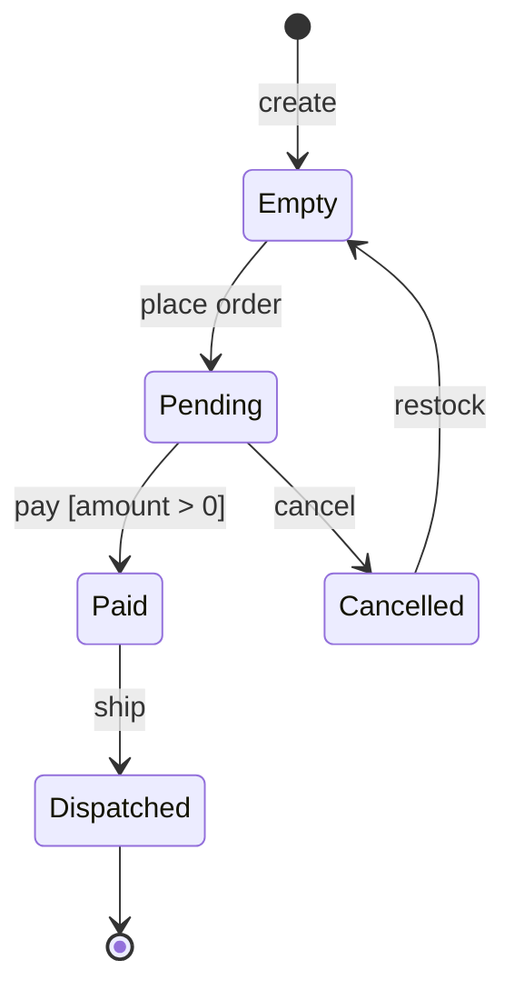

# State Machine Diagram — Concept

## What Is It?

A **UML state machine diagram** models **one object's lifecycle** — its states (rounded boxes), the events that move it between them (arrows), and the actions on entry/exit. In an LLD interview, reach for it when an object has a rich state: order, booking, elevator, traffic light, document approval.

---

## When to Use

> **Trigger keywords:** "status", "lifecycle", "states", "transitions", "cancel", "expire", "approve"

| Situation | Diagram |
|-----------|---------|
| Call order between objects | **Sequence** diagram |
| Branching business process | **Activity** diagram |
| **One object, many states** | **State Machine** diagram — this package |

Draw it when the number of states × events makes "just an enum + ifs" unreviewable.

---

## The Building Blocks

```
        ●                  ← initial (filled circle)
        │
   ┌────▼────┐  place   ┌─────────┐  pay    ┌─────────┐
   │  EMPTY  │ ────────▶ │ PENDING │ ──────▶ │  PAID   │
   └─────────┘  order    └────┬────┘  success └────┬────┘
        ▲                    │ cancel             │ ship
        │              ┌─────▼─────┐          ┌────▼──────┐
        └──────────────│ CANCELLED │          │ DISPATCHED │
           restock     └───────────┘          └───────────┘
```

| Element | Meaning |
|---------|---------|
| **State** (rounded box) | a named condition of the object (`PENDING`, `PAID`) |
| **Transition** (arrow) | `event [guard] / action` — e.g. `pay [amount > 0] / recordReceipt` |
| **Initial** `●` / **Final** `◉` | birth / death of the lifecycle |
| **Guard** `[…]` | condition that must hold for the transition |
| **Self-transition** | arrow looping back — event handled without changing state |

---

## Mermaid (renders in Obsidian)



---

## Guarding Transitions (the interview win)

```java
// ❌ Scattered ifs — illegal transitions compile fine
if (order.status == PAID) order.cancel();   // who says this is legal?

// ✅ Transition table — illegal moves are impossible to express
enum Event { PLACE, PAY, CANCEL, SHIP }
TRANSITIONS = Map.of(
    Map.entry(PENDING, PAY), PAID,
    Map.entry(PENDING, CANCEL), CANCELLED,
    Map.entry(PAID, SHIP), DISPATCHED
);
```

---

## Common Mistakes

1. **Modelling the whole system** — one diagram per stateful object, not per application.
2. **Missing guards** — `cancel` from *any* state is wrong; guard it to cancellable states only.
3. **No initial/final states** — the lifecycle's birth and death anchor the diagram.
4. **States as booleans** — `isPaid, isShipped, isCancelled` explodes; one enum + transitions scales.
5. **Forgetting illegal transitions** — explicitly saying "cancel from DISPATCHED is rejected" scores points.

---

## Related

- [[../01 - Class Diagram/Concept|Class Diagram]] — the stateful class + its enum
- [[../02 - Sequence Diagram/Concept|Sequence Diagram]] — events arrive as messages
- [[../../Concepts/01 - OOP Fundamentals/03 - Interfaces/Concept|Interfaces]] — states behind a common interface

---

#uml #state-machine-diagram #lld #concept
